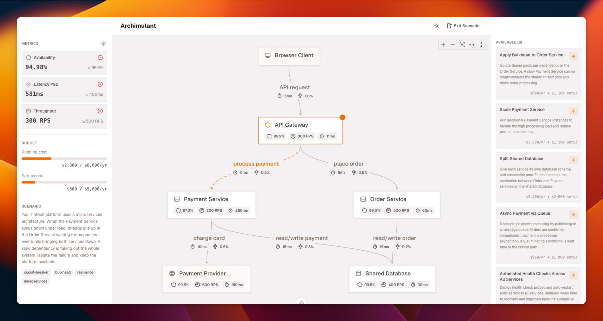

# Archimulant



Archimulant is an interactive architecture simulator designed to make software architecture tangible and fun. Rather than memorizing patterns in lectures or reading whitepapers, you **play scenarios, make trade-offs, and feel the impact immediately**.

### The Game

Pick a real-world scenario (e.g., *"E-Commerce Peak Traffic Collapse"* or *"Microservices Cascade Failure"*), then improve the system within a fixed budget:

- 🏗️ **Live topology**: Interact with a visual system diagram of services, databases, gateways, and queues
- 📊 **Real-time metrics**: Watch availability, latency, throughput, and cost shift as you apply improvements
- 💰 **Budget constraints**: Balance operational costs (yearly) vs. one-time investments. There are no infinite resources
- 🎲 **Trade-offs everywhere**: Add caching → reduces latency but risks consistency issues; scale horizontally → costs money and adds coordination complexity
- 🏆 **Compete**: Create tournament rooms, invite your team or class, and compete on the same scenario

### The Learning

Every improvement links to architectural theory:

- Circuit breakers, bulkheads, replication, caching, async messaging, health checks
- Understand *why* each pattern works and *when* to use it
- See the math behind availability, latency paths, and throughput bottlenecks

## Documentation

Explore the architecture and design decisions:

- **[Arc42 System Architecture](./docs/arc42/arc42.md)**: Full system overview, design decisions, deployment, risks
- **[Vision & Requirements](./docs/vision/README.md)**: Why Archimulant exists, user personas, assumptions
- **[UI Structure & Routing](./docs/design/ui-structure.md)**: Frontend layout, page hierarchy, navigation flow

---

## Development Setup

### Prerequisites

- **Node.js 18+**
- **pnpm 9+**
- A modern browser (Chrome, Firefox, Safari, Edge)

### Environment Variables

Copy `.env.example` to `.env.local` and customize. 

Nuxt automatically maps environment variables with the `NUXT_` prefix to `runtimeConfig` keys.

> [!note]
> Check out [`./nuxt.config.ts`](./nuxt.config.ts) for default values and reuse [`./.env.example`](./.env.example) for your local setup.

### Install & Run

```bash
# Install dependencies
pnpm install

# Start the dev server
pnpm dev
```

The app opens at `http://localhost:3000`.

### Database & Authentication

#### SQLite

Archimulant uses **SQLite** for persistence (no external database required). The database file lives at `.data/auth.db` by default.

#### Better-auth Setup

Authentication uses **better-auth** with OAuth support (Google, GitHub). To configure:

1. **Generate the schema** (if models changed):
   ```bash
   pnpm auth:generate
   ```

2. **Apply migrations**:
   ```bash
   pnpm auth:migrate
   ```

3. **Configure providers** in `auth.config.ts` (copy `.env.example` to `.env.local` and fill in OAuth credentials if needed for local testing).

### Hexagonal Architecture

The codebase follows **Hexagonal Architecture (Ports & Adapters)** with strict dependency rules:

```
adapters ──► ports ◄── application ──► domain
                          │
                          └─► domain (pure TS, no I/O)
```

Key folders:

- **`server/domain/`**: Business logic, types, invariants (pure TypeScript, zero framework imports)
- **`server/ports/`**: Interfaces for repositories, loggers, external services
- **`server/application/`**: Use cases that orchestrate ports and domain logic
- **`server/adapters/`**: Implementations of ports (database, HTTP clients, auth)
- **`server/api/`**: HTTP endpoints (thin translation layer)

Dependencies flow inward only. A domain type never imports from an adapter; an adapter never calls a use case directly.


### Building & Deployment

#### Build for Production

```bash
pnpm build
```

Generates optimized bundles in `.output/`.

#### Preview Production Build Locally

```bash
pnpm preview
```
