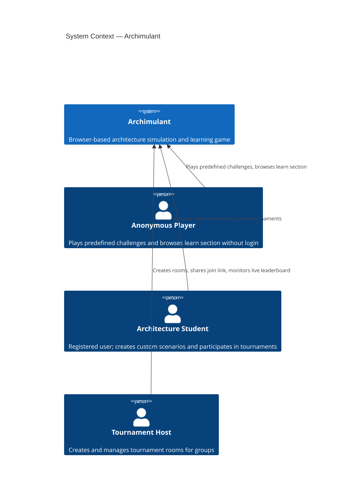
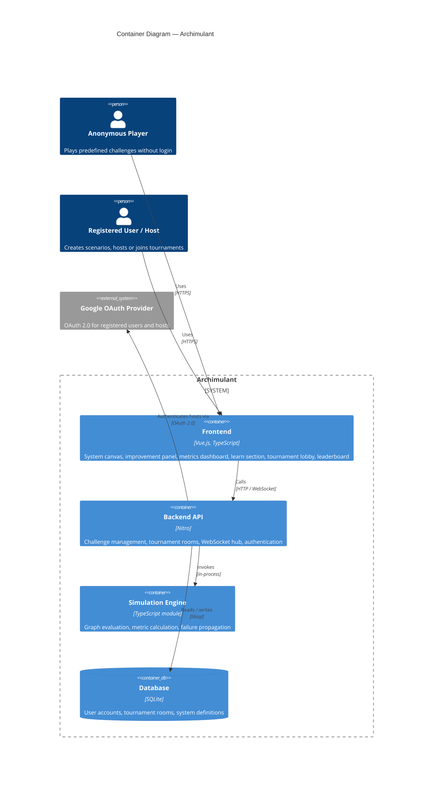
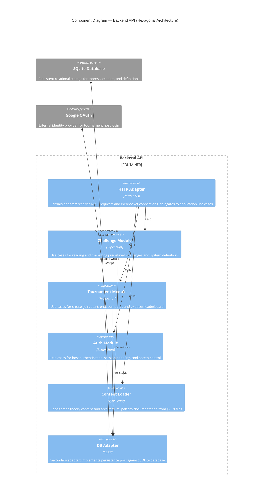
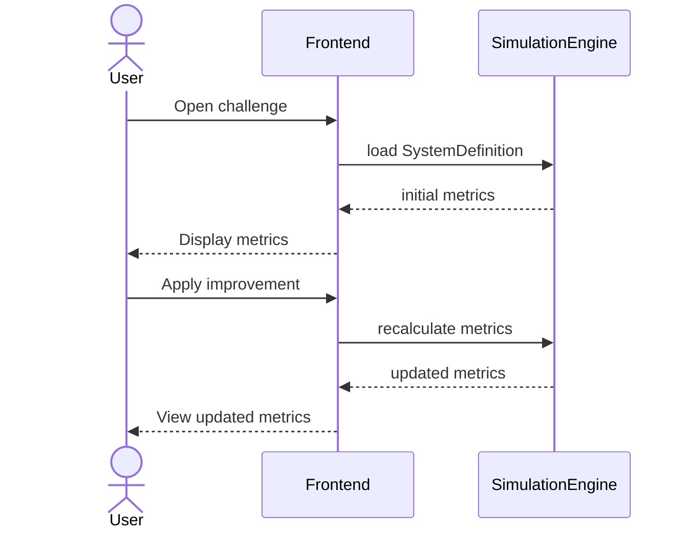
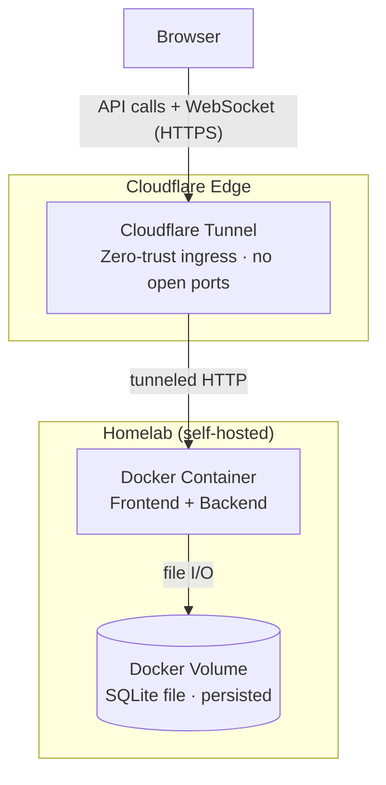
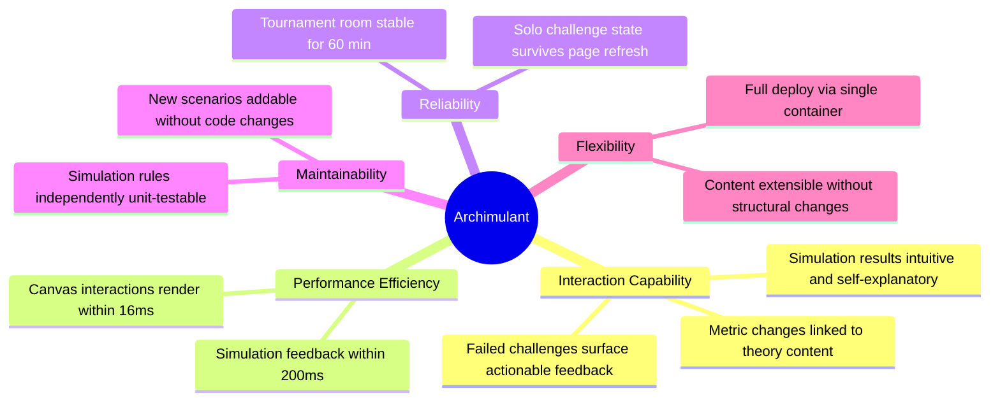

# arc42 — Archimulant

> Architecture documentation following the arc42 template.
>
> Version: 0.1 · Status: Draft · Author: Tobias Blum

---

## Table of Contents

1. [Introduction and Goals](#1-introduction-and-goals)
2. [Constraints](#2-constraints)
3. [Context and Scope](#3-context-and-scope)
4. [Solution Strategy](#4-solution-strategy)
5. [Building Block View](#5-building-block-view)
6. [Runtime View](#6-runtime-view)
7. [Deployment View](#7-deployment-view)
8. [Cross-cutting Concepts](#8-cross-cutting-concepts)
9. [Architecture Decisions](#9-architecture-decisions)
10. [Quality Requirements](#10-quality-requirements)
11. [Risks and Technical Debt](#11-risks-and-technical-debt)
12. [Glossary](#12-glossary)

---

## 1. Introduction and Goals

### 1.1 Purpose

Archimulant is a browser-based architecture simulation game designed to teach software architecture concepts through interactive challenges. Users design distributed systems, apply architectural improvements, and observe the impact on quality metrics such as availability, latency, and cost - all within a defined budget.

The project serves a dual purpose: as an educational tool for architecture students and practitioners, and as a portfolio artifact demonstrating applied knowledge from the CAS Software Architecture program.

### 1.2 Key Requirements

| ID  | Requirement                                                                       |
| --- | --------------------------------------------------------------------------------- |
| R1  | Users can interact with a distributed system topology on an interactive canvas    |
| R2  | The simulation engine calculates quality metrics based on the defined topology    |
| R3  | Improvement cards can be applied to the system; each has a cost and metric impact |
| R4  | Challenges define a starting topology, a budget, and target quality metrics       |
| R5  | A learn section provides theory content linked to architectural patterns          |
| R6  | Tournament hosts can create rooms and share a join code with participants         |
| R7  | Tournament participants join without registration using a nickname                |
| R8  | A leaderboard ranks participants by quality achievement and remaining budget      |
| R9  | Users can define their own system topology                                        |
| R10 | Basic gameplay (predefined challenges, learn section) is accessible without login |

### 1.3 Quality Goals

Quality goals are aligned with **ISO 25010:2023** product quality characteristics.

| Priority | Characteristic                                         | Motivation                                                                                                                                  |
| -------- | ------------------------------------------------------ | ------------------------------------------------------------------------------------------------------------------------------------------- |
| 1        | Interaction Capability · Learnability, User engagement | Simulation results must be intuitive and self-explanatory — pedagogical clarity takes precedence over simulation precision                  |
| 2        | Performance Efficiency · Time behaviour                | Canvas interactions must render within 16ms; simulation feedback must appear within 200ms of a user action                                  |
| 3        | Reliability · Availability, Fault tolerance            | Tournament sessions must remain stable and consistent for the full duration of a class or workshop (~60 min)                                |
| 4        | Maintainability · Modifiability, Testability           | Content (scenarios, improvements, theory cards) must be editable without code changes; simulation rules must be independently unit-testable |
| 5        | Flexibility · Installability, Adaptability             | The system must be deployable as a single Docker container; content must be extensible without structural changes                          |

### 1.4 Stakeholders

| Role                 | Description                                                                         | Expectations                                                   |
| -------------------- | ----------------------------------------------------------------------------------- | -------------------------------------------------------------- |
| Anonymous player     | Casual visitor; plays predefined challenges and browses learn section without login | Zero friction entry, no registration wall                      |
| Architecture student | Registered learner; creates custom scenarios and joins or hosts tournaments         | Engaging gameplay, clear feedback, educational value           |
| Tournament host      | Instructor or peer who creates and runs a tournament room                           | Easy setup, live overview of participants, shareable link      |
| Portfolio reviewer   | Recruiter or architect reviewing the project                                        | Clean architecture, documented decisions, demonstrated breadth |
| System operator      | Developer maintaining the live instance                                             | Low operational overhead, free-tier hosting                    |

---

## 2. Constraints

### 2.1 Technical Constraints

| Constraint                                   | Background                                                       |
| -------------------------------------------- | ---------------------------------------------------------------- |
| Runs entirely in the browser (no native app) | Target audience uses desktop browsers; no app store distribution |
| Self-hosted on homelab via Docker            | Portfolio project — no cloud cost; full control over deployment  |
| No native mobile support in v1               | Canvas interaction requires pointer precision; mobile deferred   |
| Simulation logic must be deterministic       | Reproducible results required for fair tournament scoring        |

### 2.2 Organizational Constraints

| Constraint            | Background                                                                          |
| --------------------- | ----------------------------------------------------------------------------------- |
| Single developer      | All design, implementation, and content creation by one person                      |
| Weekend project scope | Features must be scoped to what is achievable in focused evening / weekend sessions |
| English-only content  | Broadest reach for portfolio, German can be added later                             |

### 2.3 Conventions

| Convention                           | Background                                                                              |
| ------------------------------------ | --------------------------------------------------------------------------------------- |
| arc42 for architecture documentation | Required as CAS deliverable and portfolio standard                                      |
| Multi iteration approach             | Implementation will be done in multiple phases to show off as soon as possible          |
| Content-as-data                      | All scenarios, improvements, and theory cards defined in json data files, not hardcoded |

---

## 3. Context and Scope

### 3.1 Business Context

---

## 4. Solution Strategy

### Core Decisions

| Decision                       | Choice                                                                                     | Rationale                                                                                                          |
| ------------------------------ | ------------------------------------------------------------------------------------------ | ------------------------------------------------------------------------------------------------------------------ |
| System topology representation | Directed graph (nodes + edges)                                                             | Natural fit for service dependencies; maps to VueFlow primitives                                                   |
| Content model                  | JSON data files                                                                            | Allows easy understanding and adjustability directly without UI, trackable in git                                  |
| Architecture pattern           | Modular Frontend + Backend API + Simulation Engine, implemented as Monolith for simplicity | Clear separation; simulation engine is independently testable                                                      |
| Architecture documentation     | C4 model (Context, Container, Component, Code)                                             | Tool-independent, scales from business context to code level, widely understood. Omits code level for this project |
| Auth technology                | [Better-Auth](https://better-auth.com/) as part of backend service                         | No separate auth service needed, implemented based on a library as part of monolith                                |
| Real-time tournament sync      | WebSockets                                                                                 | Low-latency state broadcast to all participants in a room                                                          |

### Architectural Approach

The simulation engine is the central kernel — a pure, stateless function that maps a `SystemDefinition` + applied `Improvements` to `QualityMetrics`. This function has no framework dependencies and is covered by unit tests independently of the UI.

The backend manages tournament rooms and persists state. The frontend handles all rendering and local simulation feedback. For tournaments, the backend becomes the source of truth and pushes state updates via WebSocket.

---

## 5. Building Block View

### 5.1 Level 2 — Container View

### 5.2 Level 3 — Backend API Components

The backend follows a **hexagonal architecture** (Ports and Adapters). The application core contains all business logic and is isolated from infrastructure. Primary adapters drive the core from outside (REST, WebSocket); the DB Adapter implements the outbound persistence port. Authentication is handled directly by Better-Auth within the Auth Module, which integrates with Google OAuth without a separate adapter layer.

---

## 6. Runtime View

Runtime views use sequence diagrams as the C4 model's recommended notation for dynamic interactions. Each scenario maps to the containers defined in Chapter 5.

### 6.1 Solo Challenge Flow

---

## 7. Deployment View

### 7.1 Infrastructure Overview

### 7.2 Environments

| Environment | Purpose                 | Notes                                                                                  |
| ----------- | ----------------------- | -------------------------------------------------------------------------------------- |
| Local       | Development             | Backend + frontend run locally, SQLite file on disk                                    |
| Production  | Live portfolio instance | Docker container on homelab, SQLite persisted in volume, exposed via Cloudflare Tunnel |

---

## 8. Cross-cutting Concepts

### 8.1 Simulation Model

The simulation engine is a pure function: `simulate(system, improvements) → metrics`. Metric calculation follows simplified but plausible rules:

- **Availability**: weakest-link propagation through the dependency graph (series components multiply; parallel components improve)
- **Latency**: sum of edge latencies along the critical path
- **Throughput**: bottleneck node constrains the chain
- **Cost**: sum of all improvement costs + baseline infrastructure cost

### 8.2 Content-as-Data

All challenge scenarios, improvement cards, and learn section content are stored as structured JSON data files under `content/`. No content is hardcoded in components or API handlers. This allows the content to evolve independently of the application code.

### 8.3 Authentication and Authorization

Login is only required to access features that involve persistent identity: creating custom scenarios or hosting a tournament. All predefined content is accessible without an account to minimise the initial barrier to interaction.

| Actor                  | Auth mechanism                 | Scope                                                     |
| ---------------------- | ------------------------------ | --------------------------------------------------------- |
| Anonymous player       | None                           | Play predefined challenges, browse learn section          |
| Tournament participant | Nickname + room code           | Join a tournament room, submit solutions                  |
| Registered user        | OAuth (Google) via Better-Auth | Create and save custom scenarios                          |
| Tournament host        | OAuth (Google) via Better-Auth | Create and manage tournament rooms, access host dashboard |

### 8.4 Real-time Communication

WebSocket connections are scoped to a tournament room. The backend hub maintains a map of `roomCode → Set<connection>` and broadcasts state mutations to all members. Connection state is in-memory; no persistent WebSocket state is stored.

---

## 9. Architecture Decisions

> Detailed ADRs are maintained as separate files in `docs/arc42/adr/`.

| ID      | Decision                                             | Status   |
| ------- | ---------------------------------------------------- | -------- |
| ADR-001 | Nitro for the backend runtime, Nuxt for the frontend | Accepted |
| ADR-002 | Use VueFlow for the system canvas                    | Accepted |
| ADR-003 | Content-as-data using JSON files                     | Proposed |
| ADR-004 | SQLite file as the persistence layer                 | Accepted |

---

## 10. Quality Requirements

### 10.1 Quality Tree

### 10.2 Quality Scenarios

| ID  | ISO 25010 Characteristic | Scenario                                        | Expected Response                                             |
| --- | ------------------------ | ----------------------------------------------- | ------------------------------------------------------------- |
| QS1 | Performance Efficiency   | User applies an improvement card                | Metrics update within 200ms                                   |
| QS2 | Reliability              | 20 participants in a tournament room for 60 min | No dropped connections, consistent state                      |
| QS3 | Maintainability          | New scenario added to content files             | Available in-game after next deployment without code changes  |
| QS4 | Interaction Capability   | User fails a challenge                          | System shows which target metrics were missed and by how much |
| QS5 | Flexibility              | Fresh deploy from clean repo                    | Frontend + backend live within 10 minutes                     |

---

## 11. Risks and Technical Debt

| ID  | Risk                                               | Probability | Impact | Mitigation                                                       |
| --- | -------------------------------------------------- | ----------- | ------ | ---------------------------------------------------------------- |
| R1  | Simulation model too simplistic to feel meaningful | Medium      | High   | Validate with at least 3 test scenarios before content creation  |
| R2  | VueFlow performance degrades with large graphs     | Low         | Medium | Limit node count per system definition; profile early            |
| R3  | WebSocket scaling under tournament load            | Low         | Medium | Single-room scope; profile early                                 |
| R4  | Scope creep delays v1 completion                   | High        | High   | Strict v1 feature gate; chaos mode and story mode deferred to v2 |
| R5  | arc42 documentation drifts from implementation     | Medium      | Medium | Document decisions at time of making, not retrospectively        |

---

## 12. Glossary

| Term                  | Definition                                                                                                             |
| --------------------- | ---------------------------------------------------------------------------------------------------------------------- |
| **System Definition** | The complete description of a simulated distributed system: nodes, edges, baseline metrics, and available improvements |
| **Node**              | A component in the simulated system (service, database, queue, CDN, load balancer, client)                             |
| **Edge**              | A directed connection between two nodes, characterized by latency, throughput, and failure rate                        |
| **Improvement**       | An architectural countermeasure (e.g. caching, replication, circuit breaker) with associated costs and metric impacts  |
| **Challenge**         | A game scenario: a system definition, a budget, available improvements, and target quality metrics                     |
| **Metric**            | A measurable quality attribute of the simulated system: availability, p99 latency, max throughput, monthly cost        |
| **Tournament**        | A multiplayer session in which participants solve the same challenge independently, ranked by a scoring function       |
| **Room Code**         | A short alphanumeric code used to join a tournament room without authentication                                        |
| **Simulation Engine** | The pure function library that computes quality metrics from a system definition and a set of applied improvements     |
| **Tick**              | One evaluation cycle of the simulation engine                                                                          |
| **ADR**               | Architecture Decision Record — a document capturing a significant architectural decision and its rationale             |
| **CAS**               | Certificate of Advanced Studies — the academic program this project accompanies                                        |
